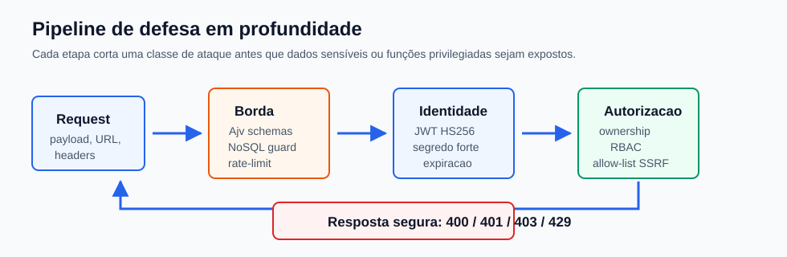
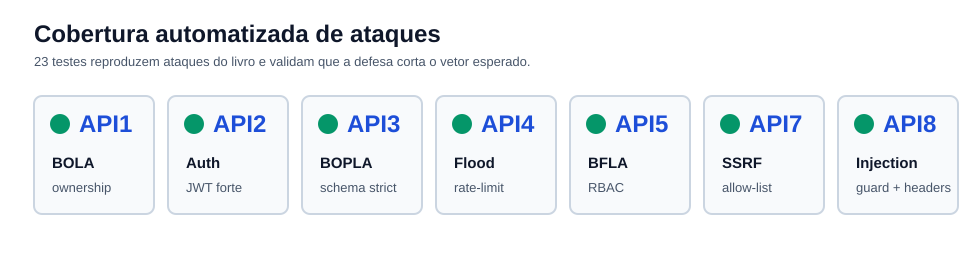

# Segurança da API



Esta pasta concentra utilitários e documentação das defesas implementadas na API. A suíte em `src/test/owasp.security.test.ts` transforma ataques do OWASP API Security Top 10 (2023), descritos no livro *API Security for White Hat Hackers*, em testes automatizados.

Resultado esperado da suíte:

```bash
npm test
```

```text
tests 23
suites 8
pass 23
fail 0
```



## Ataques Neutralizados

| OWASP | Ataque reproduzido | Defesa implementada | Onde |
| --- | --- | --- | --- |
| API1 BOLA | Trocar o ID na URL para acessar recurso de outro usuário. | Ownership check: `ownerId === user.sub`; falha retorna `403`. | `src/routes/secure.routes.ts` |
| API2 Broken Auth | Exploit `alg:none` do `jwt_tool`. | `verify.algorithms: ['HS256']` trava o algoritmo aceito. | `src/plugins/30-auth.ts` |
| API2 Broken Auth | Brute-force de segredo fraco com `jwt_tool` + `crunch`. | `JWT_SECRET` com mínimo de 32 caracteres, validado no boot. | `src/configs/env.schema.ts` |
| API2 Broken Auth | Enumeração de usuários no login. | Mensagem genérica idêntica para e-mail inexistente e senha errada. | `src/routes/auth.routes.ts` |
| API3 BOPLA | Injetar `role: "admin"` no body para escalar privilégio. | `additionalProperties: false` nos schemas e `removeAdditional: 'all'` no Ajv. | `src/routes/auth.routes.ts`, `src/app.ts` |
| API4 Resource Consumption | Brute-force por flood no endpoint de login. | Rate-limit dedicado no login, padrão `5/min`; excesso retorna `429`. | `src/routes/auth.routes.ts` |
| API5 BFLA | Usuário comum chamando função administrativa. | RBAC com `requireRole('admin')`; falha retorna `403`. | `src/plugins/30-auth.ts` |
| API7 SSRF | URL apontando para rede interna ou `169.254.169.254`. | Allow-list de host, protocolo e porta, com bloqueio de IPs privados. | `src/security/ssrf-guard.ts` |
| API8 Injection | Payload NoSQL como `{"$ne": null}` para bypass. | Hook `preValidation` rejeita operadores `$` e chaves com `.`. | `src/plugins/40-nosql-guard.ts` |
| API8 Misconfiguration | `X-Powered-By` exposto e erros verbosos com stack trace. | Helmet remove headers inseguros; error handler não vaza stack. | `src/plugins/10-security.ts`, `src/app.ts` |

## Como Ler os Testes

### API1 BOLA

O teste faz login como Alice e tenta acessar `GET /documents/d2`, documento pertencente ao Bob. A rota exige JWT válido e compara o dono real do documento com `request.user.sub`. A resposta correta é `403`, sem vazar o conteúdo do Bob.

### API2 Broken Authentication

Os testes cobrem três vetores: token `alg:none`, token assinado com segredo errado e rota protegida sem token. O plugin JWT aceita somente `HS256`, usa segredo obrigatório de 32 ou mais caracteres e emite tokens com expiração.

Também há teste contra enumeração no login: senha errada para usuário existente e e-mail inexistente retornam o mesmo `401` com a mesma mensagem.

### API3 BOPLA / Mass Assignment

O teste envia campos extras como `role: "admin"` e `isAdmin: true` no login. O schema da rota não declara esses campos, e o Ajv está configurado para remover propriedades adicionais. O token emitido continua refletindo o papel real do usuário: `user`.

### API4 Resource Consumption

O teste cria uma instância dedicada da aplicação com `LOGIN_RATE_LIMIT_MAX=3` e dispara várias tentativas de login inválido. As primeiras respostas são `401`, mas o flood é cortado por `429`.

### API5 BFLA

O teste usa um token de usuário comum contra `GET /admin/stats`. A rota combina `authenticate` com `requireRole('admin')`, então autenticação sozinha não basta. Usuário comum recebe `403`; admin recebe `200`.

### API7 SSRF

O teste envia URLs para metadata cloud, loopback, localhost, redes privadas, protocolo `file:` e credenciais embutidas. Todas são rejeitadas antes de qualquer `fetch`. Apenas `https://api.exemplo-confiavel.com` na porta `443` passa pela allow-list.

### API8 Injection e Misconfiguration

O guard anti-NoSQL roda em `preValidation` e inspeciona `body`, `query` e `params`. Qualquer chave iniciando com `$`, como `$ne` ou `$gt`, ou contendo `.`, é bloqueada com `400`.

Os testes de misconfiguration confirmam que a resposta não expõe `X-Powered-By`, que headers do Helmet estão presentes e que erros não vazam stack trace, caminhos internos ou `node_modules`.

## Arquivos Principais

| Arquivo | Responsabilidade |
| --- | --- |
| `src/plugins/30-auth.ts` | JWT, algoritmo fixo, autenticação e RBAC. |
| `src/plugins/40-nosql-guard.ts` | Bloqueio de operadores NoSQL em entradas do cliente. |
| `src/security/ssrf-guard.ts` | Validação de URLs de saída contra SSRF. |
| `src/security/user-store.ts` | Store em memória usado nos testes de autorização. |
| `src/routes/auth.routes.ts` | Login, `/auth/me`, anti-enumeração e rate-limit de login. |
| `src/routes/secure.routes.ts` | Rotas de BOLA, BFLA e SSRF. |
| `src/test/owasp.security.test.ts` | Contrato executável de segurança com 23 testes. |

## Comandos de Verificação

```bash
npm test
npm run typecheck
npm run build
npm audit --omit=dev
```

O audit de produção deve retornar `found 0 vulnerabilities`.
